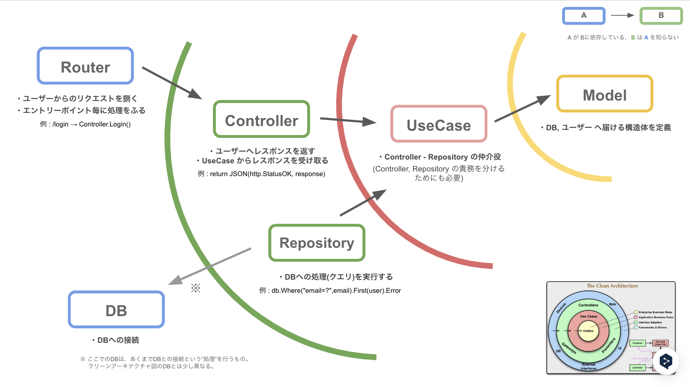

# practice-go

バックエンドのキャッチアップをするためのリポジトリです。
GO言語を用いた REST API の構築を行います。

## rest-api

**クリーンアーキテクチャ**を採用
依存の方向を 内側向き に限定して実装する。また、依存する際には interface を用いて、依存度を小さくしテストをしやすくしている。

 

Q. Router - UseCase - DB だけでも良いのでは？

A.
動けば良い という前提のもとなら良い。
しかし、Controller, Repository がなくなると、UseCase に Controller,Repository が担当していた処理を書く必要がある。これでは、ユーザー,DBを対象とした責務の異なる処理(※)をUseCase単体で実装する必要が出てきてしまい、責務や依存関係が不明確になるためやめる。

※ 処理の例として
・Controller : レスポンスへのCookie付与,DBからのデータをレスポンス型へのマッピング
・Repository : クエリの作成, DBから取得したデータの異常検知
